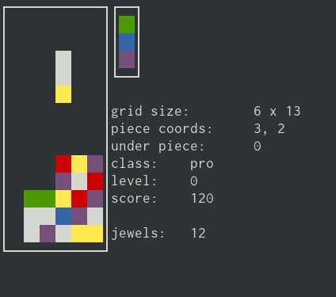

# TinyCols
A tiny Columns clone for the Linux terminal.

## Features
- [x] Single player mode
- [x] Levels
- [x] Scoring
- [ ] Hi-score table
- [ ] 2 player vs. mode
- [ ] Computer vs. mode
- [ ] Internet vs. mode
- [ ] A.I. vs. mode

## Controls
| key | actions                      |
|-----|------------------------------|
| →   | move piece right             |
| ←   | move piece left              |
| ↓   | move piece down (accelerate) |
| ↑   | rotate jewels upwards        |

## Build

### Pre-requisites
 - `ncurses-devel`
 - A C compiler

### Instructions
Run `make`, then `./build/tinycols`

## Test
Run `make test`, then `./build/test`

