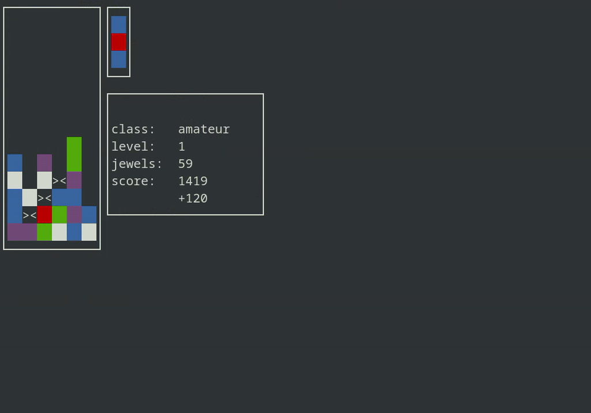

# TinyCols
A jewels matching game for the Unix terminal.

## Features
- [x] Single player mode
- [x] Levels (infinite mode)
- [x] Scoring
- [x] Color
- [ ] Magic jewel
- [ ] NO_COLOR
- [ ] Configuration menu
- [ ] Hi-score table
- [ ] Flash columns mode
- [ ] 2 player vs. mode
- [ ] Computer vs. mode
- [ ] Internet vs. mode
- [ ] A.I. vs. mode

## Controls
| key | actions                      |
|-----|------------------------------|
| →   | move piece right             |
| ←   | move piece left              |
| ↓   | move piece down (accelerate) |
| ↑ a | rotate jewels upwards        |
| z   | rotate jewels downwards      |

## Build

### Pre-requisites
 - `make`
 - `gcc`
 - `ncurses-devel`

For sanitizing:
 - libasan
 - libubsan

Run with SANITIZE=1.

### Instructions
Run `make`.

## Run
Run `./build/tinycols -h` for usage information.

## Test
Run `make test`.

## AI usage policy

 - AI may be used to scan for bugs and memory leaks
 - AI may be used to implement build scripts and CI infrastructure
 - AI **has not and will not** be used to design and implement the code

The code is and will remain 100% a human creation.

